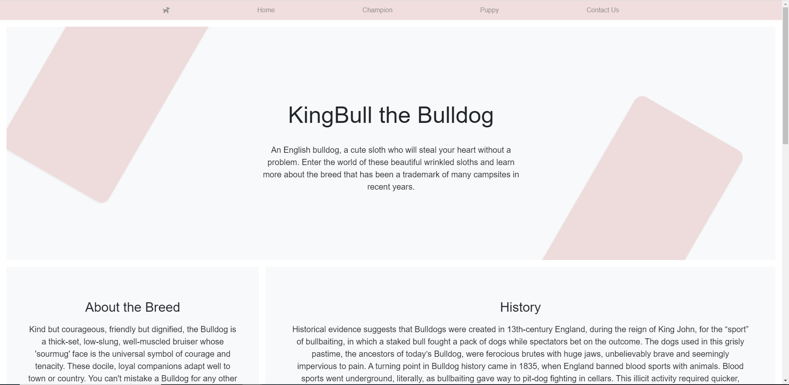

<h1 align="center">KingBull the Bulldog</h1>

Code Institute Diploma in Full-Stack Software Development Project 3

##### <u>Project name:</u>KingBull the Bulldog

### View the live project: https://github.com/petracili/MS3.git

## Contents
1. [Summary](#summary)
1. [UX](#ux)
    1. [Strategy](#strategy)
    1. [Scope](#scope)
    1. [Structure](#structure)
    1. [Skeleton](#skeleton)
    1. [Surface](#surface)
1. [Features](#features)
    1. [Existing Features](#existing-features)
    1. [Features left to implement](#left-to)
1. [Bugs](#bugs)
1. [Technologies used](#tech)
1. [Testing](#testing)
1. [Deployment](#deployment)
    1. [Github Pages](#github)
    1. [heroku](#heroku)
1. [Credits](#credits)
    1. [Content](#content)
    1. [Acknowledgements](#acks)

#  Summary
This is page is created to help new owners how bread need to look and what is best for them.

It provides a database of pictures of different dogs which can be searched, viewed, added to, removed from and edited.

#  UX
##  Strategy
### **New site user's goals:**
* As a new site user, I want to be able to browse and search for dog 
* As a new site user, I want to be able to understand the intent of the page
* As a new site user, I want I want to understand easily how to navigate the page and access the facilities provided
### **Returning user's goals**
* As a returning site user, I want to be able to log in
* As a returning site user, I want to be able to view my dog
* As a returning site user, I want to be able to edit and delete my dog
* As a returning site user, I want to be able to add new dog
### **Site owner'as goals:**
* As a site owner, I want dogs added via the site to be stored in the correct format in the database
* As a site owner, I want to be able to see who has added each dog

##  Scope
**Functional requirements:**
#### For ease of use:
* Navigation bar which is simple and easy to navigate
* A search Function
#### To ensure the database is up to date and editable:
* Function to add a dog
* Function to edit a dog
* Function to delete a dog
* For the dogs to be only editable by the creator