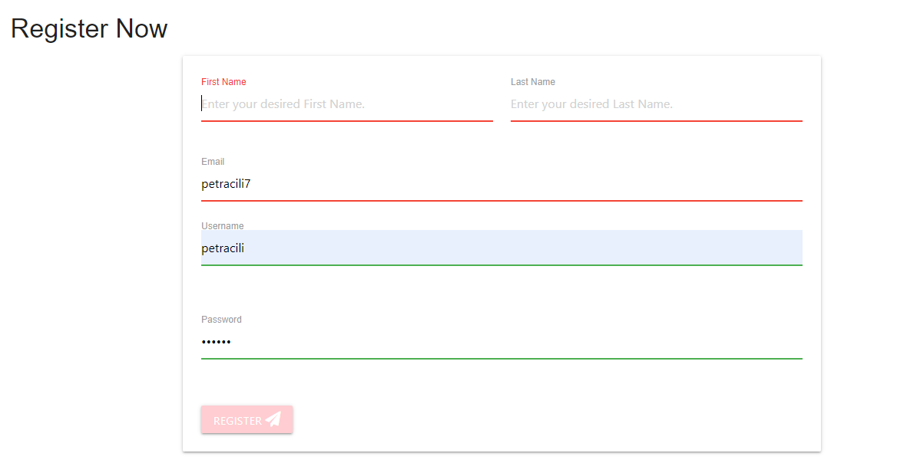

# Full Testing
## Contents
+ [Validator Testing](#validator-testing)
+ [Manually Testing Functionality](#manually-testing-functionality)
+ [Responsive Testing](#responsive-testing)
---
---

## Validator Testing
### **HTML**

 I checked all of the HTML pages using [W3C Markup Validation Service](https://validator.w3.org/)

 I check from the live site by right clicking each page, selecting View Page Source and running that generated code through the validator.

 All pages passed all checks. 

 

### **CSS**

I checked the CSS file using [W3C CSS Markup Validation Service](https://jigsaw.w3.org/css-validator/)

All pages passed all checks. 

### **JavaScript**

I checked the script.js file using [JSHint](https://jshint.com/).

Same as on HTML Validation I have to chenck each js file. 

Only what coming is a few waring but I dont have error. 

### **Python**
I checked the app.py file using [PEP8 online](http://pep8online.com/)

The code passed all checks.

---
---

## Manually Testing Functionality

I manually checked all of the browsers specified.

### **Registration**

For registration, you are not able to create an account if you don't fill the file correctly which means that you have to fill in your first name, last name and as well correct email address. When you registered correctly, the administrator can see your user name and ID on MongoDB.

### **LogIn and LogOut**

As we can see you are not able to log in if you don't put the correct username and correct password.

As we can see you are not able to log in if you don't put the correct username and correct password.

### **Chempion Test**

On the add champion page, you can add your adult dog you have a form in which you add a picture, the title of the dog and his description. When you add your dog you will receive a notification that your dog has been successfully added as well as title pictures and a description are required.

There is also the option to edit your champion, in this option you have the option to change the image, title and description of the dog. Also, only the account holder has the option to edit the dog.

Also, the account holder is able to delete the dog, but before deleting it, he will receive a notification if he is sure that he wants to delete the dog.

### **Puppy Test**

On the puppy page, we also have the option to add our puppies, with a few more options we have to fill out, picture, name, surname, hear-colour, date of birth and nationality or where the dog comes from. we are also able to edit puppies. as with the champion, we have the option of deleting that puppy, and only the account holder can do that.

### **Profile**

As we add champions or puppies, they will automatically appear on your profile, and you can also delete or edit them there.

### **Search**

We are able to search champions or puppies by criteria (by name, nationality and gender).

### **Delete**

It is also possible to delete puppies or champions and when we press the delete button we get a notification if we are sure we want to delete the dog.

### **Contact Us**

Page contact us servers so that the user can contact the administrator who will later connect him with the breeder, the idea is to maintain the privacy and security of breeders. While filling out the email form, enter first name last name and email is required as well, email is specified to be marked @

## Manually Testing Functionality
### **base.html**

| Element               | Action        | Expected Result| Pass/Fail  |
|:-------------         |:------------- |:-----|:-----|
| **NavBar**            |               |      |
|Logo                   |Click|Redirect to home         |Pass|
|Home Link           |Click|Redirect to all home  |Pass|
|Collections Dropdown   |Click|Open collections dropdown|Pass|
|Collection page link   |Click|Redirect to collection page|Pass|
|Manage Collections link|Click|Redirect to all_collections page|Pass|
|                       |     |(Only visible if admin in session)|Pass|
|Register Link          |Click|Redirect to register page|Pass|
|                       |     |(Not visible if user in session)  |Pass|
|Log In Link            |Click|Redirect to log in page  |Pass|
|                       |     |(Not visible if user in session)  |Pass|
|Log Out Link           |Click|Log user out of account  |Pass|
|                       |Click|Redirect to log in page  |Pass|
|                       |     |(Only visible if user in session)  |Pass|
|Account Link            |Click|Redirect to account page|Pass|
|                       |     |(Only visible if user in session)  |Pass|
|Manage Collections Link|Click|Redirect to manage collections page|Pass|
|                       |     |(Only visible if admin in session) |Pass|
| **SideNav**           |       |    |
|Hamburger Icon         |Click|Open Sidenav             |Pass|
|Home Link           |Click|Redirect to all home  |Pass|
|Collections Dropdown   |Click|Open collections dropdown|Pass|
|Collection page link   |Click|Redirect to collection page|Pass|
|Manage Collections link|Click|Redirect to all_collections page|Pass|
|                       |     |(Only visible if admin in session)|Pass|
|Register Link          |Click|Redirect to register page|Pass|
|                       |     |(Not visible if user in session)  |Pass|
|Log In Link            |Click|Redirect to log in page  |Pass|
|                       |     |(Not visible if user in session)  |Pass|
|Log Out Link           |Click|Log user out of account  |Pass|
|                       |Click|Redirect to log in page  |Pass|
|                       |     |(Only visible if user in session)  |Pass|
|Account Link            |Click|Redirect to account page|Pass|
|                       |     |(Only visible if user in session)  |Pass|
|Manage Collections Link|Click|Redirect to manage collections page|Pass|
|                       |     |(Only visible if admin in session) |Pass|
| **Footer**            |     |     |
|Facebook Link          |Click|Open on external page    |Pass|
|Instagram Link         |Click|Open on external page    |Pass|
|Twtter Link            |Click|Open on external page    |Pass|

---
### **index.html**
| Element               | Action            | Expected Result           | Pass/Fail  |
|:-------------         |:-------------     |:-----                     |:-----|
| **Carousel**          |                   |                           |    |
|Home Link          |Click              |Redirect to Home page  |Pass|
|Chempion Link          |Click              |Redirect to Chempion page  |Pass|
|Puppy Link            |Click              |Redirect to Puppy page    |Pass|
|Add Chempion Link        |Click              |Redirect to Add Chempion page|Pass|
|Add Puppy Link         |Click              |Redirect to Add Puppy page |Pass|
|Profile Link          |Click              |Redirect to Profile page  |Pass|
|Register Link          |Click              |Redirect to register page  |Pass|
|Log In Link            |Click              |Redirect to log in page    |Pass|
|Edit Chempion Link          |Click              |Redirect to Edit Chempion page  |Pass|
|Edit Puppy Link          |Click              |Redirect to Edit Puppy page  |Pass|
| **Inline Links**      |                   |                           |    |
|Sign Up link           |Click              |Redirect to Register Page  |Pass|
|Sign In link           |Click              |Redirect to Login page     |Pass|

---

### add_chempion/puppy.html

| Element                   | Action            | Expected Result                   | Pass/Fail  |
|:-------------             |:-------------     |:-----                             |:-----|
| **Form**                  |                   |                                   |    |
|Choose Collection dropdown |Click              |Reveal collection options          |Pass|
|Text input fields          |Type into          |Text appears, line highlights white|Pass|
|Text input fields          |Leave blank        |Line highlights white                |Pass|
|Text input fields          |Just input whitespace  |Line highlights white            |Pass|
|Tooltips                   |Hover/click        |Reveal notes/instructions          |Pass|
|Add ingredient btn         |Click              |Generate new input field           |Pass|
|Delete ingredient btn      |Click              |Delete new input field             |Pass|
|Add method step btn        |Click              |Generate new method step field     |Pass|
|Delete method step btn     |Click              |Delete new method step field       |Pass|
|Add recichempion/puppype btn(all fields correct)|Click       |Dog uploads to database         |Pass|
|                           |                   |Redirect to account page           |Pass|
|Add chempion/puppy btn(some incorrect fields)|Click    |Page scrolls to incorrect fields   |Pass|

---
### **edit_chempion/puppy.html**

| Element                   | Action            | Expected Result                   | Pass/Fail  |
|:-------------             |:-------------     |:-----                             |:-----|
| **Form**                  |                   |                                   |    |
|All fields                 |On page open       |Pre-populated with previous inputs |Pass|
|Choose Collection dropdown |Click              |Reveal collection options          |Pass|
|Text input fields          |Type into          |Text appears, line highlights green|Pass|
|Text input fields          |Leave blank        |Line highlights red                |Pass|
|Text input fields          |Just input whitespace  |Line highlights red            |Pass|
|Tooltips                   |Hover/click        |Reveal notes/instructions          |Pass|
|Add chempion/puppy btn         |Click              |Generate new input field           |Pass|
|Delete chempion/puppy btn      |Click              |Delete new input field             |Pass|
|Add method step btn        |Click              |Generate new method step field     |Pass|
|Delete method step btn     |Click              |Delete new method step field       |Pass|
|Update btn(all fields correct)|Click           |chempion/puppy updates on database         |Pass|
|                           |                   |Redirect to account page           |Pass|
|                           |                   |"chempion/puppy Edited!" confirmation message  |Pass|
|Update btn(some incorrect fields)|Click        |Page scrolls to incorrect fields   |Pass|
|Cancel btn                 |Click              |No changes made to chempion/puppy          |Pass|
|                           |                   |Redirect to account page           |Pass|

---
### **login.html**

| Element                   | Action            | Expected Result                   | Pass/Fail  |
|:-------------             |:-------------     |:-----                             |:-----|
|**Form**                   |Click              |Redirect to previous page          |Pass|
|Username                   |Text input         |Text displayed to user             |Pass|
|Password                   |Text input         |Password hidden to user            |Pass|
|Submit btn (fields correct)|Click              |Redirect to account page           |Pass|
|Submit btn (fields incorrect)|Click            |Reload log in page                 |Pass|
|**Redirect Link**          |                   |                                   |    |
|'Register here' link       |Click              |Redirect to registration page      |Pass|

---
### **register.html**

| Element                   | Action            | Expected Result                   | Pass/Fail  |
|:-------------             |:-------------     |:-----                             |:-----|
|**Form**                   |Click              |Redirect to previous page          |Pass|
|Username                   |Text input         |Text displayed to user             |Pass|
|Password                   |Text input         |Password hidden to user            |Pass|
|**Submit btn**             |                   |                                   |    |
|Fields correct             |Click              |New user added to database         |Pass|
|                           |                   |Redirect to account page           |Pass|
|Fields incorrect format    |Click              |Fields highlighted red, user prompted to change format |Pass|
|Username already in use    |Click              |Reload register page, error message to user    |Pass|
|**Redirect Link**          ||||
|'Log in here' link         |Click              |Redirect to log in page            |Pass|

---
### **Chempion/Puppy pages**
*All collections pages have identical functionality so all the below test apply to each collection page:*

| Element                   | Action            | Expected Result                   | Pass/Fail  |
|:-------------             |:-------------     |:-----                             |:-----|
|Puppy Card                |On page load       |Only display Puppy in that category|Pass|
|Chempion Card                |Hover/click        |Reveal chempion action buttons       |Pass|
|**If nothing in collection**|                  |                                   |    |
|User message               |On page load       |Message informs user that there's no recipes in collection|Pass|
|Log in link                |On page load       |Redirect to log in page            |Pass|
|Register link              |On page load       |Redirect to registration page      |Pass|

---

### add_collection.html

| Element                   | Action            | Expected Result                   | Pass/Fail  |
|:-------------             |:-------------     |:-----                             |:-----|
| **Form**                  |                   |                                   |    |
|Text input fields          |Type into          |Text appears, line highlights green|Pass|
|Text input fields          |Leave blank        |Line highlights red                |Pass|
|Text input fields          |Just input whitespace  |Line highlights red            |Pass|
|Tooltips                   |Hover/click        |Reveal notes/instructions          |Pass|
|Add collection btn(all fields correct)|Click   |Collection uploads to database     |Pass|
|                           |                   |Redirect to all_collections page   |Pass|
|                           |                   |"New Collection Added!" confirmation message|Pass|
|Add collection btn(some incorrect fields)|Click|Page scrolls to incorrect fields   |Pass|

---
### **edit_collection.html**

| Element                   | Action            | Expected Result                   | Pass/Fail  |
|:-------------             |:-------------     |:-----                             |:-----|
| **Form**                  |                   |                                   |    |
|All fields                 |On page open       |Pre-populated with previous inputs |Pass|
|Collection name input field|On click           |User unable to edit                |Pass|
|Text input fields          |Type into          |Text appears, line highlights green|Pass|
|Text input fields          |Leave blank        |Line highlights red                |Pass|
|Text input fields          |Just input whitespace  |Line highlights red            |Pass|
|Tooltips                   |Hover/click        |Reveal notes/instructions          |Pass|
|Update btn(all fields correct)|Click           |Collection updates in database     |Pass|
|                           |                   |Redirect to all_collections page   |Pass|
|                           |                   |"Collection Updated!" confirmation message  |Pass|
|Update btn(some incorrect fields)|Click        |Page scrolls to incorrect fields   |Pass|
|Cancel btn                 |Click              |No changes made to collection      |Pass|
|                           |                   |Redirect to all_collections page   |Pass|

## Responsive Testing
Through devices that I have at home/readily available to me, I was able to continuously test on:
### Phone:
+ Samsung Galaxy S9
  + Google Chrome
  + Samsung Internet
+ Huawei Y7
  + Google Chrome
+ iPhone 6
  + Safari
### Tablet
+ iPad Mini 7.9"
  + Safari
+ iPad 9.7"
  + Safari
### Computer
* Avita Pura 14" Laptop
  * Google Chrome
  * Microsoft Edge
  * Opera
  * Mozilla Firefox
### Responsinator
+ When there were devices/browsers that I didn't have access to, I used [Responsinator](https://www.responsinator.com/) to make sure that the site was responsive.

---
---

